## Lab #4 – REST API Blueprints (Java 21 / Spring Boot 3.3.x)
# Colombian School of Engineering – Software Architecture 


## 📋 Requirements
- Java 21
- Maven 3.9+

## ▶️ Project Execution
```bash
mvn clean install
mvn spring-boot:run
```
Test with `curl`:
```bash
curl -s http://localhost:8080/blueprints | jq
curl -s http://localhost:8080/blueprints/john | jq
curl -s http://localhost:8080/blueprints/john/house | jq
curl -i -X POST http://localhost:8080/blueprints -H 'Content-Type: application/json' -d '{ "author":"john","name":"kitchen","points":[{"x":1,"y":1},{"x":2,"y":2}] }'
curl -i -X PUT  http://localhost:8080/blueprints/john/kitchen/points -H 'Content-Type: application/json' -d '{ "x":3,"y":3 }'
```

> If you want to activate point filters (redundancy reduction, *undersampling*, etc.), implement new classes that implement `BlueprintsFilter` and replace them with `IdentityFilter` using `@Primary` or Spring configuration.

Open in browser:  
- Swagger UI: [http://localhost:8080/swagger-ui.html](http://localhost:8080/swagger-ui.html)  
- OpenAPI JSON: [http://localhost:8080/v3/api-docs](http://localhost:8080/v3/api-docs)  


## 🗂️ Folder Structure (architecture)

```
src/main/java/edu/eci/arsw/blueprints
  ├── model/         # Domain entities: Blueprint, Point
  ├── persistence/   # Interface + repositories (InMemory, Postgres)
  │    └── impl/     # Concrete implementations
  ├── services/      # Business logic and orchestration
  ├── filters/       # Processing filters (Identity, Redundancy, Undersampling)
  ├── controllers/   # REST Controllers (BlueprintsAPIController)
  └── config/        # Configuration (Swagger/OpenAPI, etc.)
```

> This separation follows the **logical layers** pattern (model, persistence, services, controllers), facilitating extension to new technologies or data sources.

## 📖 Lab Activities

### 1. Familiarization with the Code Base

This project follows a **layered architecture** that cleanly separates domain models, persistence, business logic, and API controllers. Below is a detailed walkthrough of every component you should understand before extending the project.

---

#### 1.1 Model Layer (`model/`)

| Class | Type | Responsibility |
|-------|------|----------------|
| `Blueprint` | Class | Represents a drawing, uniquely identified by `author` + `name`. Holds an internal `List<Point>`. Equality and `hashCode` are based solely on author and name. |
| `Point` | Record | Immutable 2-D coordinate `(int x, int y)`. Used to define the geometry of a blueprint. |

Key behaviors to note:
- `Blueprint.getPoints()` returns an **unmodifiable view** — you cannot mutate the list externally.
- `Blueprint.addPoint(Point p)` is the only way to append a point after construction.
- Two `Blueprint` objects are considered equal if they share the same `author` and `name`, regardless of their points.

---

#### 1.2 Persistence Layer (`persistence/`)

| Component | Role |
|-----------|------|
| `BlueprintPersistence` | Interface defining the storage contract (save, get by author/name, list all, add point). |
| `InMemoryBlueprintPersistence` | Concrete implementation using a thread-safe `ConcurrentHashMap`. Pre-loaded with sample blueprints for `john` and `jane`. |
| `BlueprintNotFoundException` | Thrown when a requested blueprint does not exist. |
| `BlueprintPersistenceException` | Thrown when a persistence constraint is violated (e.g., duplicate blueprint). |

The map key is `"author:name"` — a simple composite string that guarantees uniqueness.

Sample data loaded on startup:
```
john/house   → 4 points
john/garage  → 3 points
jane/garden  → 3 points
```

---

#### 1.3 Service Layer (`services/`)

`BlueprintsServices` is the **orchestration layer** between controllers and persistence. It:
- Delegates all CRUD operations to the injected `BlueprintPersistence` bean.
- Applies the injected `BlueprintsFilter` before returning blueprints to callers.
- Is annotated `@Service`, so Spring manages its lifecycle and injects its dependencies automatically.

> **Important:** Filters are only applied in `getBlueprint(author, name)` — not in `getAllBlueprints()` or `getBlueprintsByAuthor()`. Keep this in mind when extending the logic.

---

#### 1.4 Controller Layer (`controllers/`)

`BlueprintsAPIController` exposes the REST API at `/blueprints` and maps HTTP verbs to service calls:

| Method | Path | Action | Success Code |
|--------|------|--------|-------------|
| `GET` | `/blueprints` | List all blueprints | `200 OK` |
| `GET` | `/blueprints/{author}` | Blueprints by author | `200 OK` |
| `GET` | `/blueprints/{author}/{bpname}` | Single blueprint | `200 OK` |
| `POST` | `/blueprints` | Create new blueprint | `201 Created` |
| `PUT` | `/blueprints/{author}/{bpname}/points` | Add a point | `202 Accepted` |

The inner record `NewBlueprintRequest` acts as the **DTO** for POST requests, validated with `@NotBlank` and `@Valid`.

---

#### 1.5 Filters Layer (`filters/`)

| Filter | Profile | Behavior |
|--------|---------|----------|
| `IdentityFilter` | *(default)* | Returns the blueprint unchanged. |
| `RedundancyFilter` | `redundancy` | Removes consecutive duplicate points. |
| `UndersamplingFilter` | `undersampling` | Keeps only even-indexed points (1 out of every 2). |

Filters are activated via **Spring profiles**. Only one filter bean is active at a time. To switch filters, run with:
```bash
# Redundancy filter
mvn spring-boot:run -Dspring-boot.run.profiles=redundancy

# Undersampling filter
mvn spring-boot:run -Dspring-boot.run.profiles=undersampling
```

---

#### 1.6 Request / Response Flow

```
Client
  │
  ▼
BlueprintsAPIController        ← validates HTTP input, sets status codes
  │
  ▼
BlueprintsServices             ← orchestrates business logic, applies filter
  │
  ▼
BlueprintPersistence (impl)    ← reads/writes data store
  │
  ▼
In-Memory Map / PostgreSQL     ← actual storage
```

### 2. Migration to PostgreSQL Persistence

This section describes how the persistence layer was migrated from in-memory storage (`InMemoryBlueprintPersistence`) to a real PostgreSQL database, while maintaining the `BlueprintPersistence` interface contract without modifying any other layer of the project.

---

#### 2.1 Solution Architecture

The following components were added without touching the existing code:

```
persistence/
  ├── entity/
  │    ├── BlueprintEntity.java        ← JPA entity for the blueprints table
  │    └── PointEntity.java            ← JPA entity for the points table
  ├── jpa/
  │    └── BlueprintJpaRepository.java ← Spring Data JPA (auto-generated queries)
  └── impl/
       └── PostgresBlueprintPersistence.java ← Implements BlueprintPersistence
```

The Postgres implementation is only activated with the `postgres` Spring profile (`@Profile("postgres")`) and is annotated with `@Primary` to override `InMemoryBlueprintPersistence` when that profile is active.

---

#### 2.2 Dependencies Added to `pom.xml`

```xml
<dependency>
  <groupId>org.springframework.boot</groupId>
  <artifactId>spring-boot-starter-data-jpa</artifactId>
</dependency>
<dependency>
  <groupId>org.postgresql</groupId>
  <artifactId>postgresql</artifactId>
  <scope>runtime</scope>
</dependency>
```

---

#### 2.3 Database Configuration

The file `src/main/resources/application-postgres.properties` was created (only active with the `postgres` profile):

```properties
# DataSource
spring.datasource.url=jdbc:postgresql://localhost:5432/blueprints
spring.datasource.username=postgres
spring.datasource.password=postgres
spring.datasource.driver-class-name=org.postgresql.Driver

# JPA / Hibernate
spring.jpa.hibernate.ddl-auto=update
spring.jpa.show-sql=true
spring.jpa.properties.hibernate.format_sql=true

# Seed data
spring.sql.init.mode=always
spring.jpa.defer-datasource-initialization=true
```

> **Note:** `ddl-auto=update` lets Hibernate create/update tables automatically on startup. No SQL script needs to be run manually.

---

#### 2.4 Starting PostgreSQL with Docker

**Prerequisite:** have [Docker Desktop](https://www.docker.com/products/docker-desktop/) installed and running.

```bash
docker run --name blueprints-db \
  -e POSTGRES_USER=postgres \
  -e POSTGRES_PASSWORD=postgres \
  -e POSTGRES_DB=blueprints \
  -p 5432:5432 \
  -d postgres:16
```

Verify the container is running:

```bash
docker ps
```

You should see `blueprints-db` with status `Up`.

> **⚠️ Common issue on Windows:** if port 5432 is already in use by a local PostgreSQL installation, stop that service before running Docker, or change the container port to `-p 5433:5432` and update the URL in `application-postgres.properties` to `jdbc:postgresql://localhost:5433/blueprints`.

---

#### 2.5 Running the Application with the `postgres` Profile

```bash
mvn spring-boot:run "-Dspring-boot.run.profiles=postgres"
```

On successful startup you will see in the logs:

```
HikariPool-1 - Start completed.
Hibernate: create table if not exists blueprints ...
Hibernate: create table if not exists points ...
Tomcat started on port 8080 (http)
```

---

#### 2.6 Verifying Data in the Database

Connect to the container and query the tables:

```bash
docker exec -it blueprints-db psql -U postgres -d blueprints
```

```sql
-- List created tables
\dt

-- View blueprints
SELECT * FROM blueprints;

-- View blueprints with their points
SELECT b.author, b.name, p.x, p.y, p.position
FROM blueprints b JOIN points p ON p.blueprint_id = b.id
ORDER BY b.author, b.name, p.position;
```

Expected output:

```
 author | name  | x  | y  | position
--------+-------+----+----+----------
 john   | house |  0 |  0 |        0
 john   | house | 10 |  0 |        1
 john   | house | 10 | 10 |        2
 john   | house |  0 | 10 |        3
```

---

#### 2.7 Auto-Generated Relational Model

Hibernate automatically generates two tables:

**`blueprints`**
| Column | Type    | Description                  |
|--------|---------|------------------------------|
| id     | BIGINT  | Auto-incremental PK          |
| author | VARCHAR | Blueprint author             |
| name   | VARCHAR | Blueprint name               |

With a UNIQUE constraint on `(author, name)`.

**`points`**
| Column       | Type   | Description                        |
|--------------|--------|------------------------------------|
| id           | BIGINT | Auto-incremental PK                |
| x            | INT    | X coordinate                       |
| y            | INT    | Y coordinate                       |
| position     | INT    | Point order within the blueprint   |
| blueprint_id | BIGINT | FK → blueprints(id)                |

---

#### 2.8 Running Without a Database (InMemory mode)

If Docker is not available or you want to run the app without PostgreSQL, simply run without any profile. Spring will automatically use `InMemoryBlueprintPersistence`:

```bash
mvn spring-boot:run
```

---

#### 2.9 Stopping and Restarting the Container

```bash
# Stop the container
docker stop blueprints-db

# Restart it (data is preserved)
docker start blueprints-db

# Remove it completely (deletes all data)
docker rm -f blueprints-db
```
  
### 3. REST API Best Practices
- Change the base path of controllers to `/api/v1/blueprints`.  
- Use correct **HTTP codes**:  
  - `200 OK` (successful queries).  
  - `201 Created` (creation).  
  - `202 Accepted` (updates).  
  - `400 Bad Request` (invalid data).  
  - `404 Not Found` (nonexistent resource).  
- Implement a generic uniform response class:
  ```java
  public record ApiResponse<T>(int code, String message, T data) {}
  ```
  JSON example:
  ```json
  {
    "code": 200,
    "message": "execute ok",
    "data": { "author": "john", "name": "house", "points": [...] }
  }
  ```

### 4. OpenAPI / Swagger

- Configure `springdoc-openapi` in the project.  
- Expose automatic documentation at `/swagger-ui.html`.  
- Annotate endpoints with `@Operation` and `@ApiResponse`.


---

#### 4.1 Configuration

Added the following dependency to `pom.xml`:

```xml
<dependency>
  <groupId>org.springdoc</groupId>
  <artifactId>springdoc-openapi-starter-webmvc-ui</artifactId>
  <version>2.6.0</version>
</dependency>
```

Created `OpenApiConfig.java` to customize the API documentation:

```java
@Configuration
public class OpenApiConfig {
    @Bean
    public OpenAPI api() {
        return new OpenAPI()
            .info(new Info()
                .title("ARSW Blueprints API")
                .version("v1")
                .description("REST API for blueprint management")
            )
            .servers(List.of(
                new Server()
                    .url("http://localhost:8080")
                    .description("Development Server")
            ));
    }
}
```

---

#### 4.2 Endpoint Annotations

All endpoints in `BlueprintsAPIController` were annotated with OpenAPI metadata:

- `@Operation`: Describes the endpoint's purpose and behavior
- `@ApiResponses`: Documents all possible HTTP response codes
- `@Parameter`: Describes path/query parameters
- `@Schema`: Provides examples and validation rules for request/response bodies

**Example:**

```java
@Operation(
    summary = "Get all blueprints",
    description = "Returns the complete list of blueprints stored in the system"
)
@ApiResponses(value = {
    @ApiResponse(
        responseCode = "200",
        description = "Blueprint list successfully retrieved"
    )
})
@GetMapping
public ResponseEntity<ApiResponse<Set<Blueprint>>> getAll() {
    // ...
}
```

---

#### 4.3 Accessing Swagger UI

Once the application is running, access the interactive documentation at:

🔗 **Swagger UI:** [http://localhost:8080/swagger-ui.html](http://localhost:8080/swagger-ui.html)


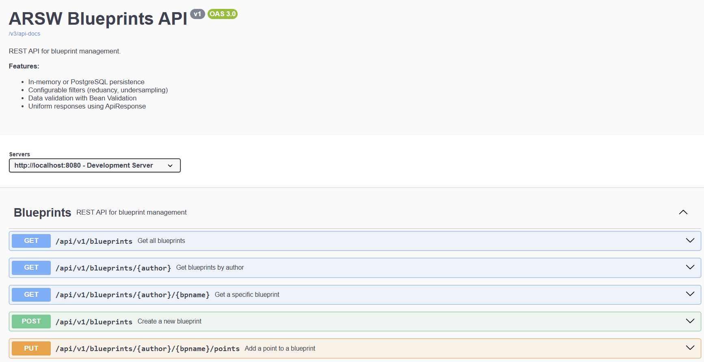

---

#### 4.4 Testing Endpoints via Swagger UI

Below are examples of testing each endpoint through the Swagger interface, along with database verification.

##### 4.4.1 GET `/api/v1/blueprints` - Get All Blueprints

**Swagger UI Interface:**

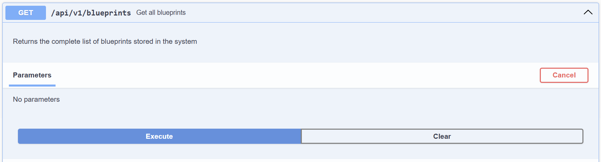
*Testing the getAllBlueprints endpoint*

**Response:**


*Successful response showing all blueprints*

**Database Verification:**

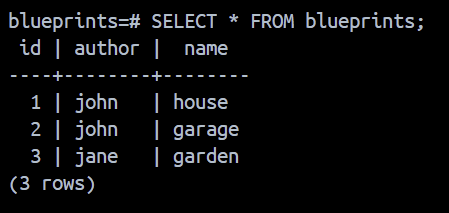
*PostgreSQL query confirming data persistence*

```sql
SELECT * FROM blueprints;
```

---

##### 4.4.2 GET `/api/v1/blueprints/{author}` - Get Blueprints by Author

**Swagger UI Interface:**

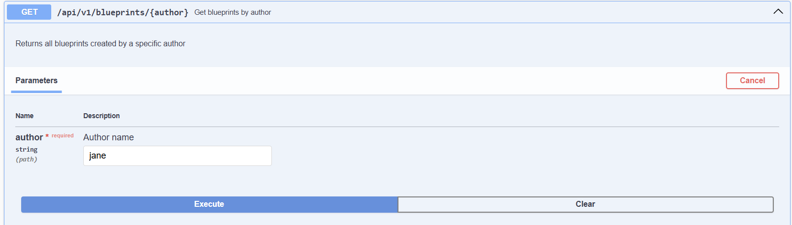
*Testing with author parameter "jane"*

**Response:**

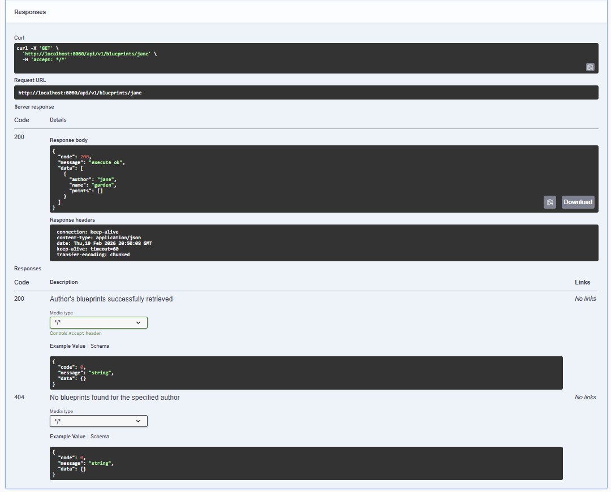
*Filtered blueprints for the specified author*

**Database Verification:**

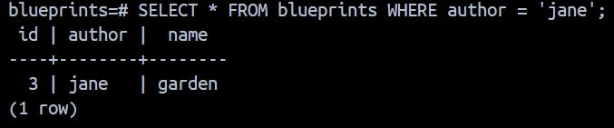
*PostgreSQL query filtering by author*

```sql
SELECT * FROM blueprints WHERE author = 'jane';
```

---

##### 4.4.3 GET `/api/v1/blueprints/{author}/{bpname}` - Get Specific Blueprint

**Swagger UI Interface:**

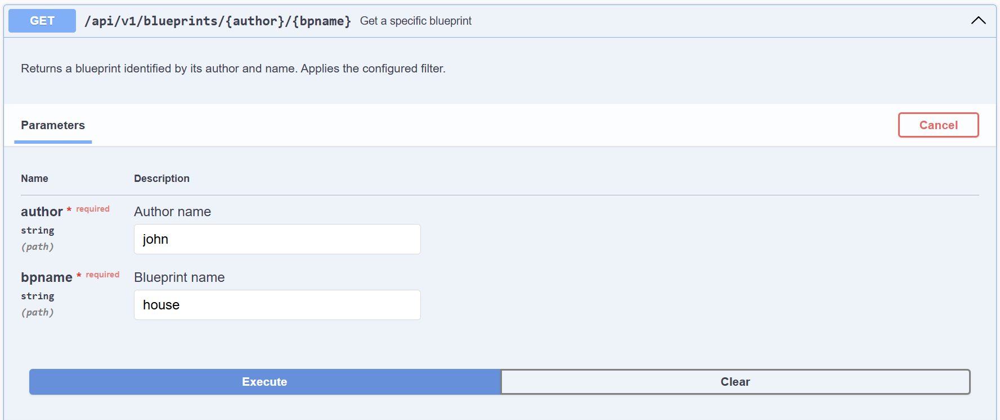
*Testing with author "john" and blueprint "house"*

**Response:**

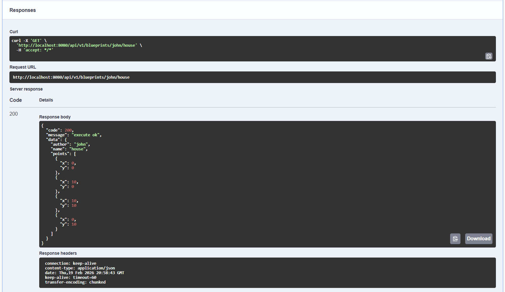
*Complete blueprint details including all points*

**Database Verification:**

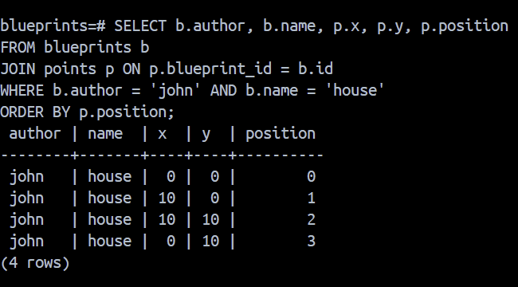
*PostgreSQL query with JOIN to show blueprint and its points*

```sql
SELECT b.author, b.name, p.x, p.y, p.position
FROM blueprints b 
JOIN points p ON p.blueprint_id = b.id
WHERE b.author = 'john' AND b.name = 'house'
ORDER BY p.position;
```

---

##### 4.4.4 POST `/api/v1/blueprints` - Create New Blueprint

**Swagger UI Interface:**

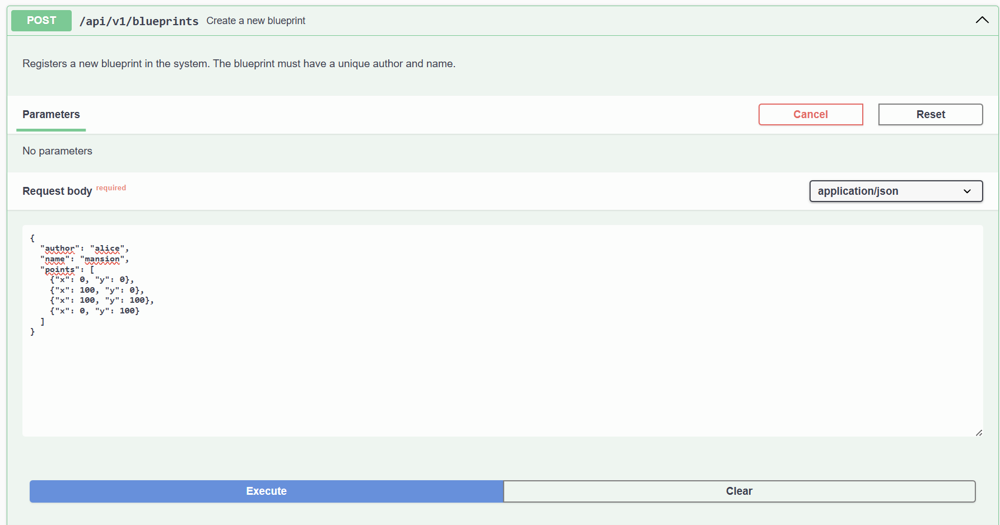
*Creating a new blueprint with request body*

**Request Body Example:**

```json
{
  "author": "alice",
  "name": "mansion",
  "points": [
    {"x": 0, "y": 0},
    {"x": 100, "y": 0},
    {"x": 100, "y": 100},
    {"x": 0, "y": 100}
  ]
}
```

**Response:**

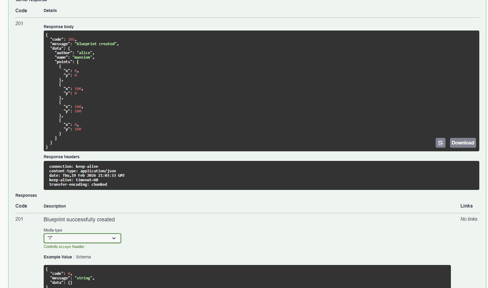
*HTTP 201 Created with the created blueprint*

**Database Verification:**

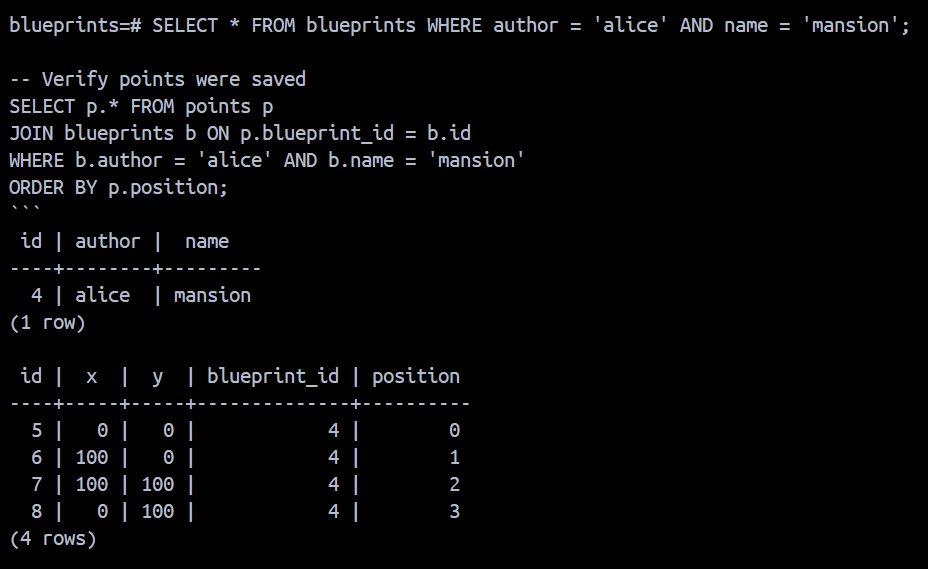
*New blueprint and points inserted into PostgreSQL*

```sql
-- Verify blueprint was created
SELECT * FROM blueprints WHERE author = 'alice' AND name = 'mansion';

-- Verify points were saved
SELECT p.* FROM points p
JOIN blueprints b ON p.blueprint_id = b.id
WHERE b.author = 'alice' AND b.name = 'mansion'
ORDER BY p.position;
```

---

##### 4.4.5 PUT `/api/v1/blueprints/{author}/{bpname}/points` - Add Point

**Swagger UI Interface:**

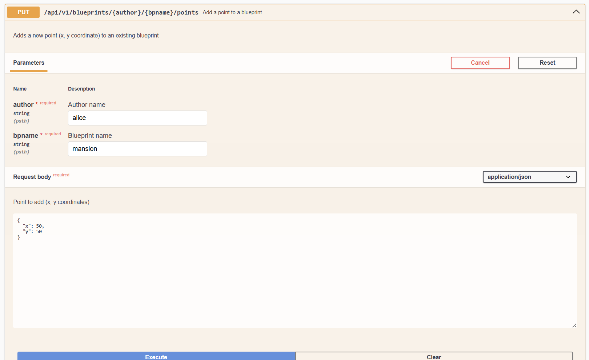
*Adding a new point to an existing blueprint*

**Request Body Example:**

```json
{
  "x": 50,
  "y": 50
}
```

**Response:**

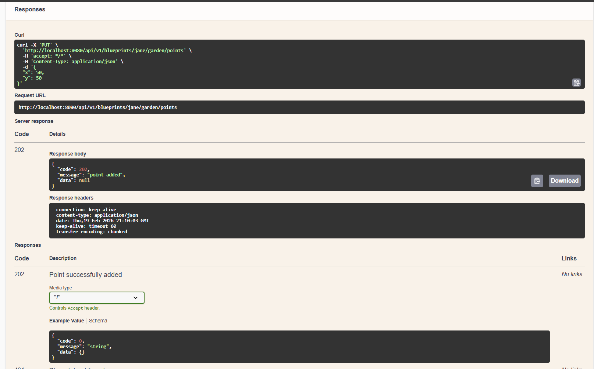
*HTTP 202 Accepted confirming point was added*


**Database Verification:**

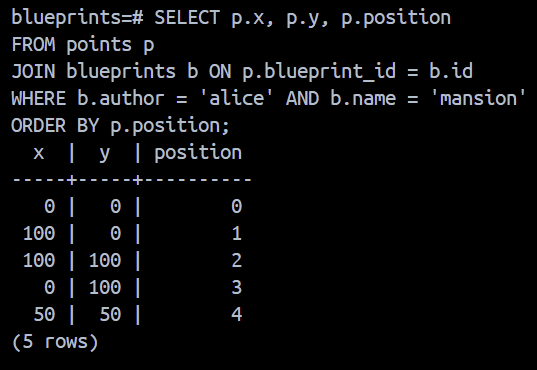
*New point successfully added*

```sql
SELECT p.x, p.y, p.position 
FROM points p
JOIN blueprints b ON p.blueprint_id = b.id
WHERE b.author = 'alice' AND b.name = 'mansion'
ORDER BY p.position;
```

---

#### 4.5 Error Handling Examples

##### 4.5.1 Blueprint Not Found (404)

**Swagger UI:**

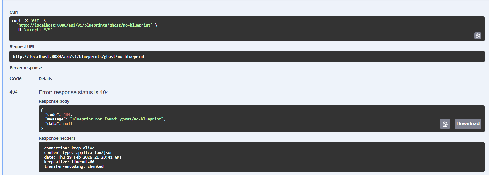
*Attempting to retrieve a non-existent blueprint*

**Response:**

```json
{
  "code": 404,
  "message": "Blueprint not found: nonexistent/blueprint",
  "data": null
}
```

---

##### 4.5.2 Duplicate Blueprint (403)

**Swagger UI:**

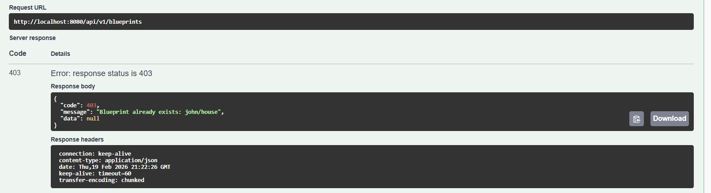
*Attempting to create a blueprint that already exists*

**Response:**

```json
{
  "code": 403,
  "message": "Blueprint already exists: john/house",
  "data": null
}
```

---

##### 4.5.3 Invalid Request (400)

**Swagger UI:**

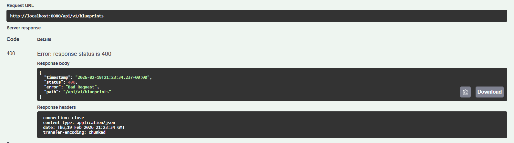
*Sending a request with missing required fields*

**Response:**

```json
{
  "code": 400,
  "message": "Validation failed",
  "data": null
}
```

---


### 5. *Blueprints* Filters
- Implement filters:
  - **RedundancyFilter**: removes consecutive duplicate points.  
  - **UndersamplingFilter**: keeps 1 out of every 2 points.  
- Activate filters using Spring profiles (`redundancy`, `undersampling`).  


## ✅ Deliverables

1. GitHub repository with:  
   - Updated source code.  
   - PostgreSQL configuration (`application.yml` or SQL script).  
   - Swagger/OpenAPI enabled.  
   - `ApiResponse<T>` class implemented.  

2. Documentation:  
   - Lab report with clear instructions.  
   - Evidence of queries in Swagger UI and evidence of messages in the database.  
   - Brief explanation of applied best practices.  


## 📊 Evaluation Criteria

| Criterion | Weight |
|----------|------|
| API design (versioning, DTOs, ApiResponse) | 25% |
| Migration to PostgreSQL (repository and correct persistence) | 25% |
| Correct use of HTTP codes and error handling | 20% |
| Documentation with OpenAPI/Swagger + README | 15% |
| Basic tests (unit or integration) | 15% |

**Bonus**:  

- Container image (`spring-boot:build-image`).  
- Metrics with Actuator.  